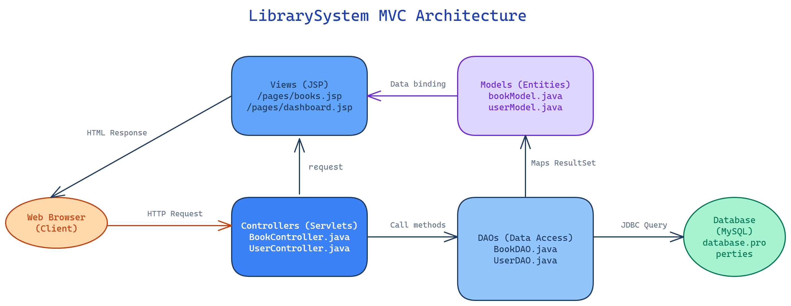
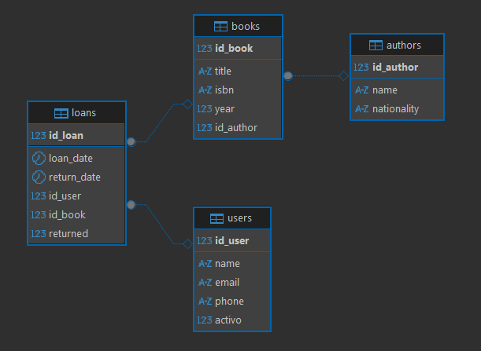
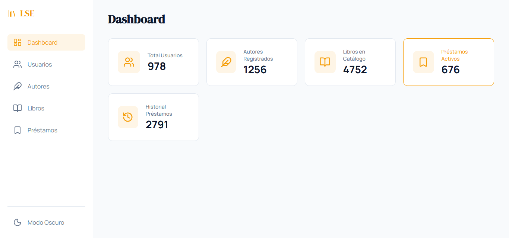
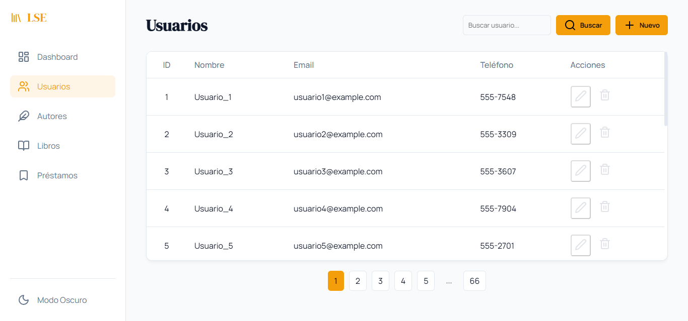
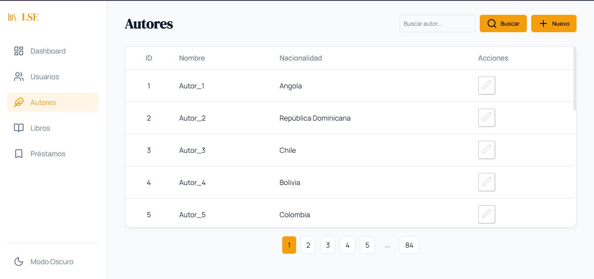
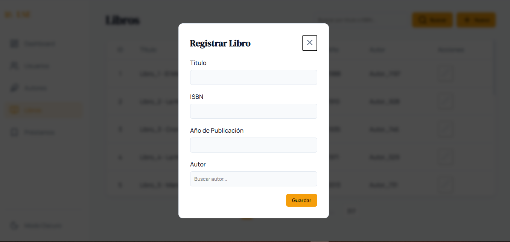
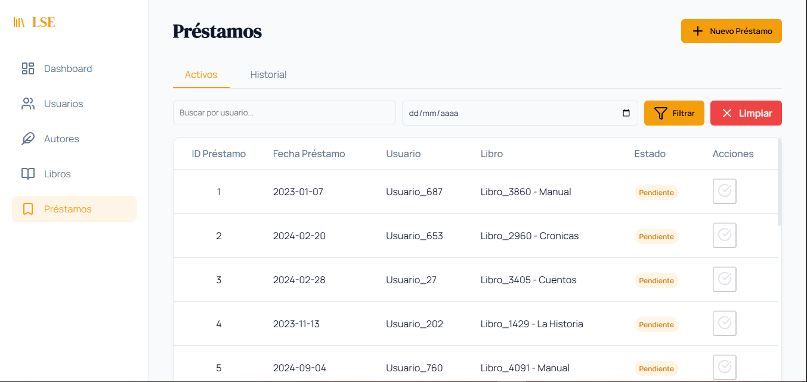

# LibrarySystem 📚

LibrarySystem es un sistema de gestión de bibliotecas para entornos académicos. Desarrollado con **Jakarta EE 10** y diseñado para **Eclipse GlassFish 7**, permite la administración de usuarios, autores, libros y préstamos.

---

## 🛠️ Referencia Técnica

Esta sección detalla los componentes técnicos y la arquitectura principal del sistema.

### Stack Tecnológico

| Componente | Tecnología |
|------------|------------|
| **Lenguaje principal** | Java 17 |
| **Plataforma Enterprise**| Jakarta EE 10 (Servlets y plantillas JSP) |
| **Servidor de Apps** | Eclipse GlassFish 7.0.25 |
| **Base de Datos** | MySQL 8.0 |
| **Controlador JDBC** | MySQL Connector/J 9.6.0 |
| **Herramienta de Build**| Apache Maven |
| **Frontend** | HTML5, CSS3 Nativo (Variables), JavaScript Vanilla |
| **Recursos Visuales** | Lucide Icons (vía CDN), Tipografías de Google Fonts |

### Arquitectura de Capas (MVC)

El proyecto mantiene una estricta separación de responsabilidades:

*   **`webapp/pages/` (Vistas):** Documentos JSP reusables para la interfaz gráfica y layouts como modales o cabeceras estáticas.
*   **`controller/` (Controladores):** Componentes (`HttpServlet`) que actúan como orquestadores del sistema, manejando peticiones HTTP (GET/POST), evaluando reglas de negocio y entregando respuestas (JSP o JSON).
*   **`dao/` y `dao/impl/` (Acceso a Datos):** Interfaces de abstracción y sus implementaciones concretas de JDBC usando conectividad controlada por `PreparedStatement`.
*   **`model/` (Entidades):** Objetos de transferencia o de valor que representan tablas únicas (Usuario, Libro, Préstamo).
*   **`CharacterEncodingFilter` (Filtro):** Middleware que garantiza que todas las peticiones y respuestas utilicen codificación UTF-8, resolviendo problemas de caracteres especiales y acentos.




### Esquema de la Base de Datos Relacional



---

## Guía de Instalación y Despliegue

Estos pasos explican cómo pasar de un entorno limpio a tener la aplicación completamente funcional en local.

### 1. Prerrequisitos de Entorno
Asegúrate de contar con los siguientes elementos instalados y en el PATH de tu máquina:
- **JDK 17**.
- **Apache Maven 3.8** o superior.
- **MySQL 8.0** o superior.
- **Eclipse GlassFish 7.0.25** (Configurado con su dominio por defecto, `domain1`).

### 2. Configuración de Base de Datos
Ingresa a tu gestor MySQL (línea de comandos o cliente visual) y crea el esquema:
```sql
CREATE DATABASE DBlibrary;

CREATE TABLE `users` (
    id_user int NOT NULL AUTO_INCREMENT,
    name varchar(100) DEFAULT NULL,
    email varchar(100) DEFAULT NULL,
    phone varchar(20) DEFAULT NULL,
    activo bit(1) DEFAULT b'1',
    PRIMARY KEY (id_user)
);


CREATE TABLE authors (
	id_author INT PRIMARY KEY AUTO_INCREMENT,
	name VARCHAR(100),
	nationality VARCHAR(50)
);

CREATE TABLE books (
	id_book INT PRIMARY KEY AUTO_INCREMENT,
	title VARCHAR(150),
	isbn VARCHAR(20),
	year INT,
	id_author INT,
	FOREIGN KEY (id_author) REFERENCES authors(id_author)
);

CREATE TABLE `loans` (
    id_loan int NOT NULL AUTO_INCREMENT,
    loan_date date DEFAULT NULL,
    return_date date DEFAULT NULL,
    id_user int DEFAULT NULL,
    id_book int DEFAULT NULL,
    returned bit(1) DEFAULT b'0',
    PRIMARY KEY (id_loan),
    KEY id_user (id_user),
    KEY id_book (id_book),
    CONSTRAINT loans_ibfk_1 FOREIGN KEY (`id_user`) REFERENCES users (id_user),
    CONSTRAINT loans_ibfk_2 FOREIGN KEY (`id_book`) REFERENCES books (id_book)
);
```
*Atención: Asegúrate de configurar correctamente tus credenciales (usuario y contraseña locales) editando el archivo de conexión correspondiente en `database/ConnectionDB.java` o el respectivo bundle properties `resources\database.properties.example`.*

### 3. Población de Datos (Opcional)
Si deseas evitar un entorno vacío y probar la eficiencia con miles de datos, ejecuta nuestra simulación:
```bash
python generate_seed.py
```
*(Carga un histórico base de 978 usuarios, 1256 autores, 4751 libros y 2791 préstamos).*

---

## Funcionalidades y Optimizaciones

### 1. Resumen Estadístico (Dashboard)
Es la página inicial del aplicativo. Expone métricas en tiempo real leyendo agregados globales para dar rápida visión operativa a administradores de recintos.



### 2. Listados Inteligentes (Usuarios y Autores)
Para evitar bloqueos al cargar grandes volúmenes de datos en una sola petición web:
*   Se limitó la consulta inicial (ej. 20 resultados).
*   Se incorporó un bloque deslizante dinámico para su paginación (limita visualmente a 5 botones).
*   Las búsquedas operan del lado del servidor SQL (`LIKE %query%`) en lugar de sobrecargar memoria RAM filtrando listas inmensas desde el backend Java.
*   *Nota en Usuarios:* Tienen eliminación "lógica". El usuario es desmarcado a falso mediante el atributo `activo` sin destruir compromisos de préstamos existentes.




### 3. Registro de Libros Anti-Duplicación
El ingreso de nuevos libros usa autocompletado en el front-end con peticiones AJAX, brindando hasta 10 respuestas cortas, evitando que el usuario envíe peticiones masivas enteras. 
Implementa prevención predictiva contra "ISBN clonados", validado usando `SELECT 1 FROM books WHERE isbn=? LIMIT 1`.



### 4. Manejo del Ciclo de Préstamos
Los componentes de préstamos en `/loans` tienen doble pestaña de visualización (Históricos vs Activos). 
Permite filtros combinados que ajustan iterativamente un `StringBuilder` en SQL, haciendo posible buscar de forma ágil desde el identificador de usuario hasta por margen de fechas.



### Endpoints AJAX 
Como referencia de la API reactiva interna que posee el sistema (Devuelve respuestas asíncronas tipo JSON al cliente JavaScript HTML):

#### 1. Buscar Usuarios
*   `GET /users?action=apiSearch&query=...`

#### 2. Buscar Autores
*   `GET /authors?action=apiSearch&query=...`

#### 3. Buscar Libros
*   `GET /books?action=apiSearch&query=...`

#### 4. Registrar/Actualizar Usuario (AJAX)
*   `POST /users`
    `Content-Type: application/x-www-form-urlencoded`
    `action=register` ó `action=update`
    `&name=Nombre Completo`
    `&email=usuario@ejemplo.com`
    `&phone=+573001234567`

#### 5. Registrar/Actualizar Autor (AJAX)
*   `POST /authors`
    `Content-Type: application/x-www-form-urlencoded`
    `action=register` ó `action=update`
    `&name=Nombre Autor`
    `&nationality=País`

#### 6. Registrar/Actualizar Libro (AJAX)
*   `POST /books`
    `Content-Type: application/x-www-form-urlencoded`
    `action=register` ó `action=update`
    `&title=Nuevo Libro Test`
    `&isbn=999-888-777`
    `&year=2024`
    `&idAuthor=1`

#### 7. Registrar Préstamo (AJAX)
*   `POST /loans`
    `Content-Type: application/x-www-form-urlencoded`
    `action=registerAjax`
    `&idUser=1`
    `&idBook=1`

---

## 📄 Licencia
Este proyecto es desarrollado y distribuido exclusivamente para propósitos formativos y académicos.
